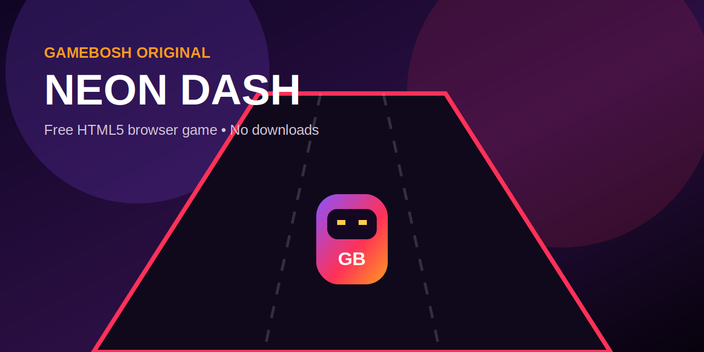

# GameBosh Neon Dash ⚡

[](https://gamebosh.com/)
[](#technology)
[](#technology)
[](LICENSE)

**GameBosh Neon Dash** is an original, responsive endless-runner browser game built with HTML5 Canvas, CSS and vanilla JavaScript. The player changes lanes, avoids barriers, collects energy orbs and uses temporary shields while the game becomes faster.

This open-source project was created as a portfolio showcase for **[GameBosh.com](https://gamebosh.com/)** — a platform for free online games that run instantly in the browser.



## Play

After publishing the repository with GitHub Pages, add your live game link here:

**Live demo:** [https://gamebosh.github.io/gamebosh-game.github.io/](https://gamebosh.github.io/gamebosh-game.github.io/)

For more free browser games, visit **[GameBosh.com](https://gamebosh.com/)**.

## Features

- Responsive HTML5 Canvas gameplay
- Keyboard controls: arrow keys or A/D
- Touch controls for phones and tablets
- Increasing speed and difficulty
- Energy-orb collectibles and shield power-ups
- High score saved with `localStorage`
- Pause, sound toggle and automatic pause when the tab is hidden
- SEO metadata, Open Graph tags and VideoGame structured data
- Installable web-app manifest
- No frameworks, packages or external game assets
- GitHub Pages deployment workflow included

## Controls

| Action | Keyboard | Mobile |
|---|---|---|
| Move left | `←` or `A` | Tap left side / left button |
| Move right | `→` or `D` | Tap right side / right button |
| Pause | `P` or `Esc` | Pause button |
| Start / restart | `Enter` or `Space` | On-screen button |

## Technology

- HTML5 Canvas
- CSS3 responsive design
- Vanilla JavaScript
- Web Audio API
- Web App Manifest
- GitHub Actions and GitHub Pages

## Run locally

No build step is required.

```bash
python3 -m http.server 8080
```

Then open `http://localhost:8080` in your browser.

## Publish with GitHub Pages

1. Create a public repository named `gamebosh-game.github.io` under the `gamebosh` account.
2. Upload every file from this package to the repository root.
3. Open **Settings → Pages**.
4. Under **Build and deployment**, select **Deploy from a branch**.
5. Choose the `main` branch and the `/(root)` folder, then click **Save**.
6. Open `https://gamebosh.github.io/gamebosh-game.github.io/` after the Pages deployment completes.

## Suggested repository details

**Repository name**

```text
gamebosh-game.github.io
```

**Description**

```text
A responsive HTML5 endless-runner browser game by GameBosh.com, built with Canvas, CSS and vanilla JavaScript.
```

**Website**

```text
https://gamebosh.com/
```

**Topics**

```text
html5-game browser-game javascript-game canvas-game endless-runner gamebosh free-games web-game open-source-game github-pages
```

## Customisation

The main brand colours are stored as CSS variables at the top of `styles.css`:

```css
--purple: #8c52ff;
--pink: #ff3158;
--orange: #ff9b1f;
--green: #61df8c;
```

Game behaviour, speed and scoring can be edited in `game.js`.

## Project structure

```text
gamebosh-neon-dash/
├── .nojekyll
├── assets/
│   ├── favicon.svg
│   ├── social-preview.svg
│   └── social-preview.png
├── index.html
├── styles.css
├── game.js
├── manifest.webmanifest
├── LICENSE
└── README.md
```

## About GameBosh

[GameBosh.com](https://gamebosh.com/) offers free online games that can be played directly in a modern browser without downloading or installing software. Discover action, puzzle, racing, sports, arcade, multiplayer, kids and unblocked games.

## Author

Created by **Souhail Achahod**, founder of [GameBosh.com](https://gamebosh.com/).

## License

Released under the [MIT License](LICENSE).
